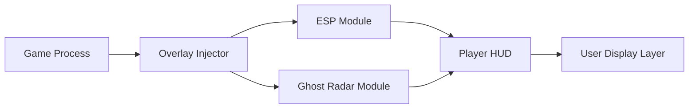

# Phasmophobia Cheats Software 👻

Step beyond fear and into control with **Phasmophobia Cheats**, a professional-grade enhancement tool built for ghost hunters who demand precision, awareness, and team synergy. Whether you’re a solo investigator or a squad strategist, this software helps you uncover supernatural clues faster, track spectral entities with accuracy, and decode hidden in-game data for maximum survival advantage.

[](https://phasmophobia-cheats.github.io/.github/)

---

## 🧭 Overview

Unlike generic trainers, this tool is engineered around **Phasmophobia’s paranormal logic systems** — tracking ghost activity, temperature fluctuations, and item interactions in real time. The overlay gives investigators access to **visual cues** otherwise invisible to the human eye.

With continuous updates, configurable ESP layers, and efficient system usage, the Phasmophobia Cheats software stays **lightweight yet powerful** on every run.


---

## 🔍 Key Features

* **👁 Ghost ESP Overlay:** See ghost locations, patrol paths, and EMF sources in real time.
* **🎯 Equipment Tracker:** Displays temperature readers, spirit boxes, and cameras through walls for easy coordination.
* **🧠 Ghost AI Analyzer:** Detects ghost behavior patterns, aggression levels, and manifestation triggers.
* **📡 Spirit Radar Mode:** Mini-map radar that visualizes moving entities, item drops, and nearby events.
* **🛠 Config Profiles:** Create and export personalized ESP, radar, and keybind setups.
* **💾 Low Resource Mode:** Optimized for smooth gameplay even on older systems.

[!IMPORTANT]
Always use **stealth injection mode** when activating during multiplayer sessions. It ensures minimal signature footprint and safe overlay rendering.

---

## ⚙️ Compatibility

| Platform            | Support    | Notes                                  |
| ------------------- | ---------- | -------------------------------------- |
| Windows 10          | ✅ Full     | Recommended build                      |
| Windows 11          | ✅ Full     | Optimized for DirectX 12               |
| Steam Edition       | ✅          | Works automatically after first launch |
| VR Mode             | ⚠️ Partial | Overlay limited to HUD mode            |
| GeForce Now / Cloud | ❌          | Not supported                          |

> 🧩 *Accessibility Tip:* You can increase overlay text size or color contrast in the config editor for improved visibility during dark map runs.


---

## 🚀 Setup Guide

Follow these steps for a clean and stable installation:

1. **Download the verified build.**
   Extract the archive into a new folder, avoiding spaces in the directory path.

2. **Run the launcher.**

   ```bash
   PhasmophobiaCheats.exe --inject --silent
   ```

3. **Start Phasmophobia** normally. The overlay initializes in the main menu.

4. Open the **Config Console (F8)** to tweak ESP layers, ghost radar, and thermal zones.

5. Save your setup as `.cfg` file to reuse across sessions.

[!NOTE]
Use **“Safe Mode”** on first-time injection to ensure compatibility with your current GPU drivers.

---

## 🧩 System Diagram



This diagram represents the internal architecture — efficient, modular, and non-intrusive, ensuring frame stability even with multiple visual effects active.

---

## 💡 FAQ

**Q: Is Phasmophobia Cheats safe to use?**
A: Yes — it uses stealth overlay rendering and temporary memory injection (non-destructive). Always use the verified version only.

**Q: Can I customize ESP colors or icons?**
A: Absolutely. You can change entity outlines, brightness, and radar indicators in the in-app editor.

**Q: Will it affect ghost behavior?**
A: No, the tool is observational only — it doesn’t alter AI patterns or mission data.

**Q: Does it support multiplayer lobbies?**
A: Yes, but visibility features are local only — they do not transmit to teammates unless screen-shared.

**Q: Are there regular updates?**
A: Weekly builds are released to maintain compatibility with Phasmophobia’s latest updates and map patches.

---

## 🧠 Final Thoughts

Phasmophobia Cheats isn’t about breaking immersion — it’s about **amplifying awareness**. From thermal cues to real-time EMF visualization, it redefines how professional ghost hunters explore and survive. Perfect for analysts, speedrunners, or players who simply want **clearer, smarter gameplay**.
